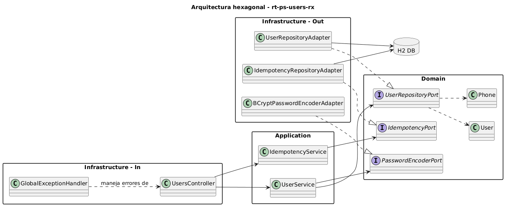
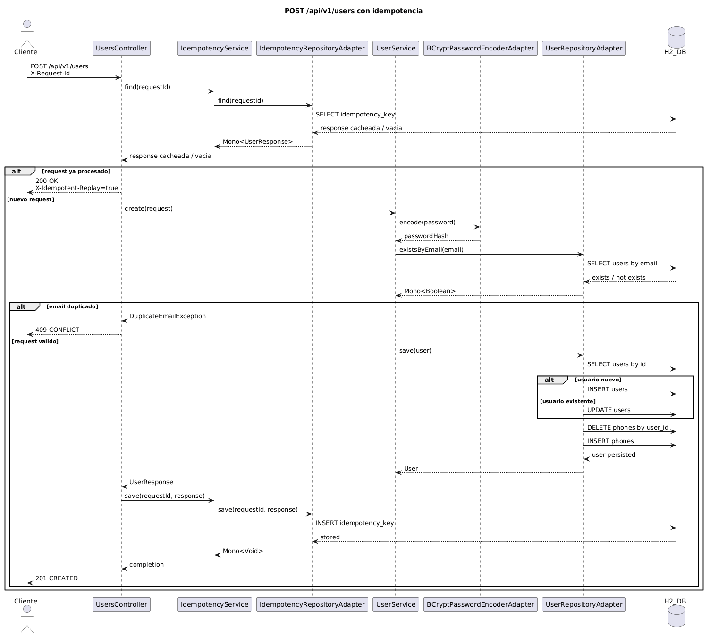

# Users Reactive Microservice

Microservicio reactivo para gestión de usuarios, implementado con Spring Boot 3, Spring WebFlux, Spring Data R2DBC y H2. El contrato OpenAPI se define primero en [src/main/resources/openapi/openapi.yml](src/main/resources/openapi/openapi.yml) y el controlador implementa las interfaces generadas.

## Objetivo cubierto

Este repositorio cumple el reto técnico con los siguientes puntos:

- Java 17 con records en el dominio.
- Spring Boot 3.x.
- Spring WebFlux con flujos Mono y Flux de extremo a extremo.
- Spring Data R2DBC con H2 reactivo.
- CRUD mínimo de usuarios: crear, listar, obtener, actualizar y eliminar.
- Manejo centralizado de errores reactivos.
- Pruebas unitarias de servicio y pruebas WebFlux con WebTestClient.
- JaCoCo con umbral mínimo de 70% en la capa de servicios.
- Dockerfile y docker-compose.yml para ejecución reproducible.

## Stack

- Java 17
- Spring Boot 3.2.5
- Spring WebFlux
- Spring Data R2DBC
- H2 Database con driver R2DBC
- JUnit 5
- Mockito
- JaCoCo
- OpenAPI Generator
- Docker y Docker Compose

## Arquitectura

Se mantiene una estructura tipo hexagonal:

- domain: records y puertos del dominio.
- application: servicio de negocio reactivo.
- infrastructure/adapter/in: controlador WebFlux y manejo de errores.
- infrastructure/adapter/out: persistencia R2DBC y seguridad de password.
- src/main/resources/openapi: contrato OpenAPI contract-first.

## Diagramas

Diagrama de arquitectura hexagonal:

Este diagrama muestra la separación entre las capas de entrada, aplicación, dominio e infraestructura de salida. Permite visualizar cómo `UsersController` y `GlobalExceptionHandler` dependen de los servicios de aplicación, mientras que los servicios consumen puertos del dominio implementados por adapters concretos.



Fuente PlantUML: [docs/diagrams/architecture-hexagonal.puml](docs/diagrams/architecture-hexagonal.puml)

Diagrama de secuencia para creación de usuario con idempotencia:

Este diagrama describe el flujo del endpoint `POST /api/v1/users` cuando se envía el header `X-Request-Id`. Primero se consulta si ya existe una respuesta almacenada para esa clave; si no existe, se valida el correo, se persiste el usuario y finalmente se guarda la respuesta para soportar replay idempotente.



Fuente PlantUML: [docs/diagrams/sequence-create-user-idempotency.puml](docs/diagrams/sequence-create-user-idempotency.puml)

## Contrato OpenAPI

- Especificación: [src/main/resources/openapi/openapi.yml](src/main/resources/openapi/openapi.yml)
- Generación de interfaces/modelos: `mvn generate-sources`
- Documentación interactiva: `http://localhost:8080/swagger-ui.html`
- Documento OpenAPI JSON: `http://localhost:8080/v3/api-docs`

## Endpoints

- `GET /api/v1/users`
- `GET /api/v1/users/{userId}`
- `POST /api/v1/users`
- `PUT /api/v1/users/{userId}`
- `DELETE /api/v1/users/{userId}`

El endpoint `POST /api/v1/users` acepta opcionalmente el header `X-Request-Id` para idempotencia.

## Base de datos

La aplicación usa H2 en memoria vía R2DBC.

- Script de inicialización para runtime: [src/main/resources/schema.sql](src/main/resources/schema.sql)
- Script de referencia en raíz: [schema.sql](schema.sql)

## Ejecutar localmente

```bash
mvn clean spring-boot:run
```

## Ejecutar pruebas y cobertura

```bash
mvn clean test
mvn clean verify
```

Reporte JaCoCo generado en:

- `target/site/jacoco/index.html`

Cobertura validada de la capa `org.example.application.service`:

- `IdempotencyService`: 100%
- `UserService`: 92%
- Total del paquete de servicios: 93%

El umbral mínimo exigido por el reto es 70%, validado automáticamente por JaCoCo durante `mvn clean verify`.

## Ejecutar con Docker

Construir y levantar con Docker Compose:

```bash
docker compose up --build
```

También puedes construir solo la imagen:

```bash
docker build -t users-service .
docker run -p 8080:8080 --env-file .env.sample users-service
```

## Ejemplos de consumo

Crear usuario:

```bash
curl -X POST http://localhost:8080/api/v1/users \
  -H "Content-Type: application/json" \
  -H "X-Request-Id: req-001" \
  -d '{
    "name": "Juan Perez",
    "email": "juan.perez@mail.com",
    "password": "Abc12345",
    "phones": [
      {
        "number": "1234567",
        "cityCode": "1",
        "countryCode": "57"
      }
    ]
  }'
```

Listar usuarios:

```bash
curl http://localhost:8080/api/v1/users
```

Obtener usuario por id:

```bash
curl http://localhost:8080/api/v1/users/11111111-1111-1111-1111-111111111111
```

Actualizar usuario:

```bash
curl -X PUT http://localhost:8080/api/v1/users/11111111-1111-1111-1111-111111111111 \
  -H "Content-Type: application/json" \
  -d '{
    "name": "Juan Perez Actualizado",
    "email": "juan.actualizado@mail.com",
    "password": "Abc12345",
    "active": true,
    "phones": [
      {
        "number": "7654321",
        "cityCode": "51",
        "countryCode": "51"
      }
    ]
  }'
```

Eliminar usuario:

```bash
curl -X DELETE http://localhost:8080/api/v1/users/11111111-1111-1111-1111-111111111111
```

## Variables de entorno

Archivo de ejemplo: [.env.sample](.env.sample)

- `DB_URL`
- `DB_USER`
- `DB_PASS`
- `H2_CONSOLE`
- `PASSWORD_REGEX`

## Manejo de errores reactivo

La aplicación implementa manejo de errores reactivo de forma centralizada:

- En la capa de aplicación, los flujos reactivos propagan errores mediante `Mono.error(...)` y `switchIfEmpty(...)`.
- En la capa web, `GlobalExceptionHandler` traduce esas excepciones a respuestas HTTP consistentes mediante `@RestControllerAdvice`.
- El contrato de error usa `ErrorResponse`, con los campos `code`, `message`, `path`, `status` y `timestamp`.

Casos manejados:
- `400 Bad Request` para validaciones y contraseñas inválidas
- `404 Not Found` para usuarios inexistentes
- `409 Conflict` para correo duplicado
- `500 Internal Server Error` para errores no controlados